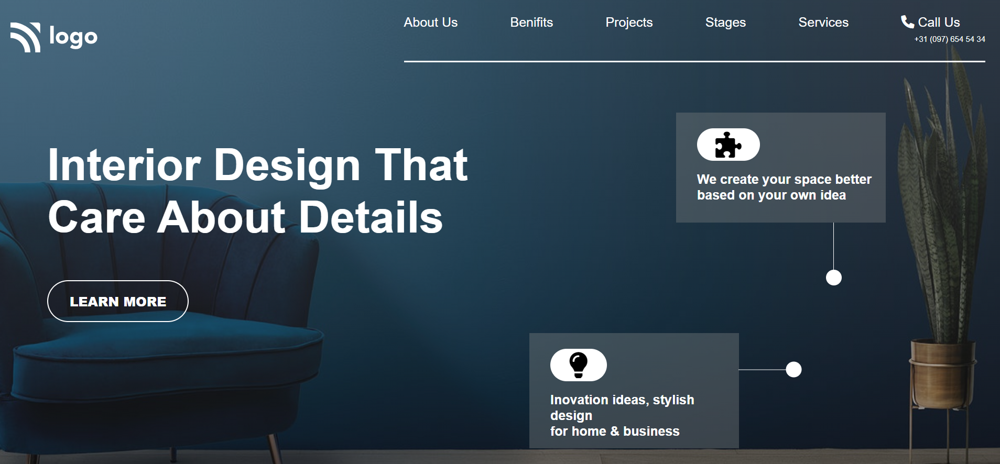

# Interior Design Page - [LINK](interior10-design-page.netlify.app)
 

 

## Skills Learned:
- Gained lots of knowledge by playing with the **Background image** and **Linear gradient**.
- Also learnt how to use colors.
***
## Time taken:
- 4hrs to build this amazing project.
***
## Project screenshot :
